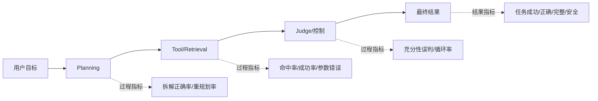

# 如何为 Agent 系统设计过程指标和结果指标？

## 原题原文

> 如果让你设计一个 agent 系统，怎么设定评定指标（过程指标+结果指标）？

## 答案

### 面试直答

过程指标回答“Agent 是怎么完成的”，结果指标回答“最终有没有完成用户目标”。设计时先定义端到端成功，再把成功拆解到规划、工具、检索、生成和系统运行；否则容易出现节点分数很好但用户任务失败。

### 一、指标映射

结果指标包括任务成功率、正确性、完整性、用户满意度和安全红线；过程指标包括计划有效率、工具选择和参数正确率、无效步骤、重复调用、证据命中、重规划次数和异常恢复率。

> **核心小结：** 结果指标做目标，过程指标做诊断，两者通过因果链路对应。

### 二、效率和可靠性是约束指标

同一成功率下，还要比较首 Token、P50/P95/P99、Token、工具次数、单请求成本、超时、恢复和人工接管。生产形态应单独报告一次直出、有限步 Loop 和深度模式，避免靠无限调用刷高成功率。

> **核心小结：** Agent 优化是受延迟、成本和风险约束的多目标优化，不是单指标竞赛。

### 三、落地方法

每个指标明确事件来源、计算口径、采样方式和负责人；给 Trace 统一 Thread、Turn、Step、Tool ID。用冻结离线集做版本回归，线上用灰度和失败桶监控。指标异常时能下钻到具体轨迹，而不是只看到总分下降。

> **核心小结：** 指标必须能由结构化事件稳定计算，并能回到失败轨迹定位原因。

### 常见追问

- **过程指标越多越好吗？** 不是，只保留能解释结果或驱动动作的指标。
- **如何设权重？** 安全先设硬门槛，再按业务价值、延迟和成本确定 Pareto 取舍。

## 问题来源

- 公司：阿里巴巴
- 页面标题：阿里面经-阿里大模型算法岗面经-02
- 面经小节：面经 02
- 岗位与面试时间：LLM 应用算法 ｜ 面试时间：2026 年 4 月 20 日
- 题目在小节内的位置：第 6 条
- 来源链接：https://www.nowcoder.com/discuss/923309821460221952
- 在线核验：2026-09-01 已在公开网页正文中逐条核验
- 证据级别：网页公开正文原文
