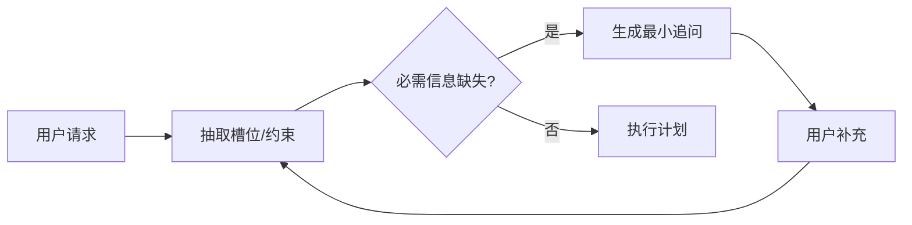

# 多轮智能追问机制应该如何设计？

## 原题原文

> 多轮智能追问是怎么样的？

## 答案

### 面试直答

多轮智能追问的目标是只问对完成任务真正必要、且当前无法可靠推断的信息。系统先维护槽位和约束状态，计算缺失信息对结果的价值，再一次询问1～3个高价值问题；用户回答后更新状态并继续，而不是重新开始。

### 一、流程

追问优先级可考虑必需性、信息增益、用户成本和是否可由工具获取。

> **核心小结：** 好追问减少不确定性，坏追问只是把系统能查到的信息推给用户。

### 二、工程设计

状态中区分未知、用户拒答、默认值和已确认；问题带选项和影响说明；限制追问轮数，低价值缺失使用默认值并声明假设。

> **核心小结：** 追问需要状态机、停止条件和默认策略，不能无限澄清。

## 问题来源

- 公司：阿里巴巴
- 页面标题：阿里面经-阿里大模型算法岗面经-02
- 面经小节：面经 03
- 岗位与面试时间：AI 应用开发 ｜ 面试时间：2026 年 4 月 15 日
- 题目在小节内的位置：第 1 条
- 来源链接：https://www.nowcoder.com/discuss/923309821460221952
- 在线核验：2026-09-01 已在公开网页正文中逐条核验
- 证据级别：网页公开正文原文
