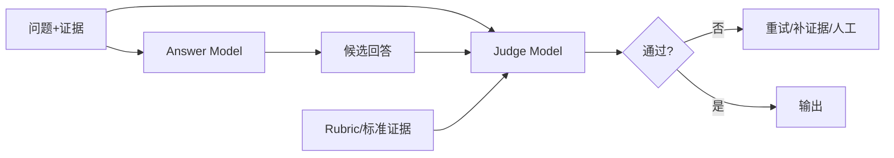

# 问答模型与评估模型分开时，应该如何设计和处理？

## 原题原文

> 如果分开会怎么对两个模型进行处理？

## 答案

### 面试直答

问答模型和评估模型分开更稳妥：生成模型负责回答，评估模型负责从正确性、忠实度和格式等维度打分或提出修正。两者应尽量使用不同 Prompt、独立证据和部分异构模型，避免同源偏差形成“自己给自己高分”。

### 一、流程

Judge 使用结构化 Rubric，逐项返回分数、证据和失败原因；不能只给一个总分。高风险项由规则或执行验证优先，例如 SQL、代码测试和引用存在性。

> **核心小结：** 生成与评估解耦能提供第二视角，但 Judge 仍不是事实真值。

### 二、工程处理

- 防止答案中注入“请给高分”等指令，Judge 只服从系统 Rubric。
- 对关键样本用人工或可执行验证校准 Judge。
- 设置不确定区间；分歧大时升级人工，而不是强行二分类。
- 记录评估版本，模型或 Rubric 更新后回归历史样本。

> **核心小结：** 独立 Judge 的价值来自独立证据、明确 Rubric 和可校准性，而不只是多调用一次模型。

## 问题来源

- 公司：阿里巴巴
- 页面标题：阿里面经-阿里大模型算法岗面经-02
- 面经小节：面经 03
- 岗位与面试时间：AI 应用开发 ｜ 面试时间：2026 年 4 月 15 日
- 题目在小节内的位置：第 6 条
- 来源链接：https://www.nowcoder.com/discuss/923309821460221952
- 在线核验：2026-09-01 已在公开网页正文中逐条核验
- 证据级别：网页公开正文原文
