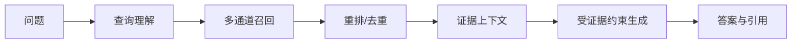

# RAG 是什么？它与传统“检索加生成”有何区别？如何评估 RAG 系统？

## 原题原文

> RAG 是什么，它和传统检索+生成的流程有何不同，如何评估一个 RAG 系统是否 work？

## 答案

### 面试直答

RAG 是 Retrieval-Augmented Generation：在生成前从外部知识源检索证据，并把证据与问题一起交给模型。与泛化的“检索加生成”相比，工程化 RAG 强调可学习的表示、查询改写、混合召回、重排、引用、权限、更新和端到端评估，而不是简单搜索后拼 Prompt。

### 一、核心机制

RAG 的知识保存在外部索引，因而可以更新和追溯；模型参数负责通用理解与生成。

> **核心小结：** RAG 将“知道什么”和“如何表达”部分解耦，外部证据在推理时动态进入 Context。

### 二、如何评估

检索层用 Recall@K、MRR/nDCG；生成层用正确性、忠实度、完整性和引用准确；端到端看任务成功率、拒答合理性、P95 延迟和成本。评测集必须包含标准证据，否则无法区分检索错还是生成错。

> **核心小结：** RAG 必须分层评估，最终答案分数不能代替检索诊断。

### 三、边界

不适合用 RAG 解决稳定行为学习、复杂技能迁移或证据库本身缺失的问题。证据不足时模型应拒答；高风险场景还需时效和来源白名单。

> **核心小结：** RAG 能降低知识幻觉，但不能保证模型自动忠实使用错误或不完整的证据。

## 问题来源

- 公司：阿里巴巴
- 页面标题：阿里面经-阿里大模型算法岗面经-02
- 面经小节：面经 05
- 岗位与面试时间：大模型算法 ｜ 面试时间：2026 年 4 月 13 日
- 题目在小节内的位置：第 4 条
- 来源链接：https://www.nowcoder.com/discuss/923309821460221952
- 在线核验：2026-09-01 已在公开网页正文中逐条核验
- 证据级别：网页公开正文原文
