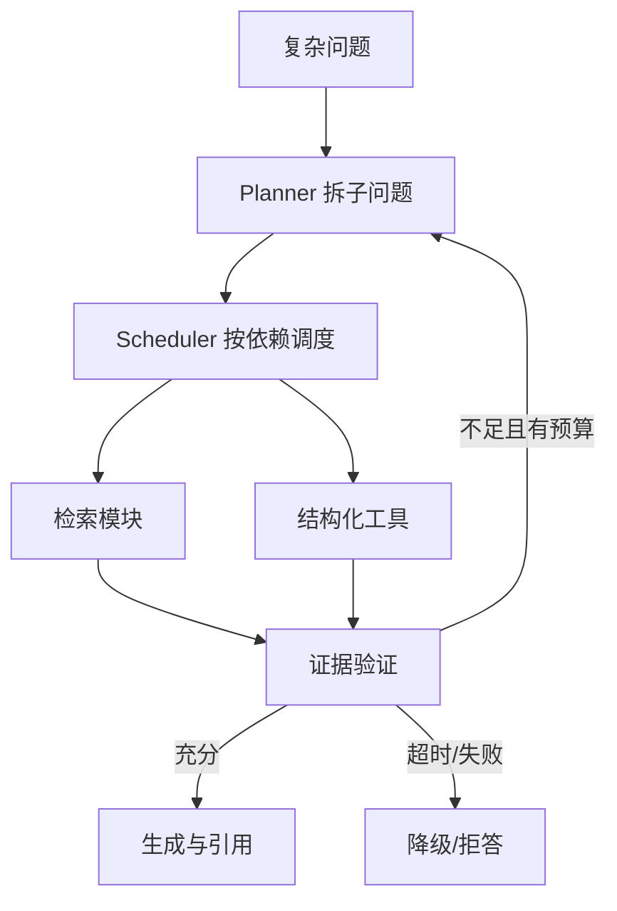

# 如何进行端到端 RAG 评估？Modular Agent 如何实现多步规划、调度和异常回退？

## 原题原文

> 有没有用过端到端的 RAG 评估框架？项目里的 Modular Agent 是怎么实现多步规划的？调度策略如何设计，有没有异常 fallback？

## 答案

### 面试直答

端到端 RAG 评估要同时测“检索到正确证据、模型忠实使用证据、系统在预算内完成”。Modular Agent 则把查询规划、检索、验证和回退拆成可观测节点，每个节点有输入输出、超时、重试和完成条件。

### 一、评估链路

评测样本保存问题、标准证据、参考答案、权限和时间条件。离线分别计算 Recall@K、排序指标、答案正确性/忠实度/引用；线上观察成功率、点击/采纳、P95 延迟和成本。

> **核心小结：** 有标准证据才能判断错误来自召回、排序还是生成。

### 二、Modular Agent

Scheduler 维护 DAG 状态，可并行无依赖任务；异常回退按错误类型选择重试、换通道、缩小范围或拒答，而不是统一重试。

> **核心小结：** Modular 的价值是把复杂检索过程拆成可替换、可评估、可回退的节点。

### 三、工程取舍

多步规划可能提高复杂问题覆盖，但增加模型轮次和长尾延迟。生产中应设置最大步骤、并发上限、缓存和总体 Deadline，并与单轮 RAG 基线对照。

> **核心小结：** 多步收益必须在相同延迟和成本预算下验证，不能只比较不限轮次的准确率。

## 问题来源

- 公司：阿里巴巴
- 页面标题：阿里面经-阿里大模型算法岗面经-02
- 面经小节：面经 05
- 岗位与面试时间：大模型算法 ｜ 面试时间：2026 年 4 月 13 日
- 题目在小节内的位置：第 5 条
- 来源链接：https://www.nowcoder.com/discuss/923309821460221952
- 在线核验：2026-09-01 已在公开网页正文中逐条核验
- 证据级别：网页公开正文原文
