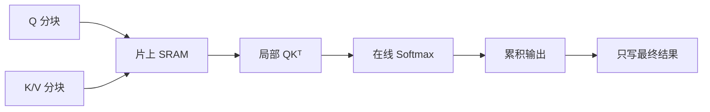

# Flash Attention 的原理？

## 原题原文

> Flash Attention 的原理？

## 答案

### 面试直答

Flash Attention 不改变标准 Attention 的数学结果。它通过 **分块计算、在线 Softmax 和算子融合**，避免把完整的注意力矩阵写入显存，从而减少显存占用和 HBM 读写。

### 一、标准 Attention 为什么慢

标准 Attention 为：

$$
S=\frac{QK^T}{\sqrt d},\qquad P=\operatorname{softmax}(S),\qquad O=PV
$$

- $Q,K,V\in\mathbb{R}^{N\times d}$，因此 $S$ 和 $P$ 都是 $N\times N$。
- 计算复杂度约为 $O(N^2d)$。
- 朴素实现会把 $S$、Softmax 结果 $P$ 等中间矩阵写入 HBM，再读回来继续计算。
- GPU 算力很强，但 HBM 带宽有限；长序列下，瓶颈经常是数据搬运而不是乘法本身。

> **核心小结：** Flash Attention 要解决的不是 $O(N^2)$ 计算本身，而是 $N\times N$ 中间矩阵带来的显存占用和读写开销。

### 二、Flash Attention 的核心原理

它把 $Q$、$K$、$V$ 切成小块，将当前块放进片上 SRAM，计算完就立刻更新输出，不保存完整的 $S$ 和 $P$。

难点在于 Softmax 需要整行数据。Flash Attention 使用在线 Softmax，让多个分块可以稳定合并。对旧分块和新分块分别维护：

- 行最大值 $m$；
- 指数和 $l=\sum_i e^{s_i-m}$；
- 未归一化输出 $a=\sum_i e^{s_i-m}v_i$。

合并新块时：

$$
m'=\max(m,m_b)
$$

$$
l'=e^{m-m'}l+e^{m_b-m'}l_b
$$

$$
a'=e^{m-m'}a+e^{m_b-m'}a_b,\qquad O=\frac{a'}{l'}
$$

减去最大值保证数值稳定；缩放旧统计量后，分块结果与一次性计算整行 Softmax 等价。

> **核心小结：** 分块解决“放不下”，在线 Softmax 解决“分块后如何保持精确”，算子融合解决“减少往返显存”。

### 三、工程实现与收益

- **前向传播**：不落盘完整注意力矩阵，只保存输出和少量 Softmax 统计量。
- **反向传播**：通常重新计算部分局部结果，用额外计算换取更少的中间状态存储。
- **复杂度**：数学计算量仍约为 $O(N^2d)$，但额外显存从 $O(N^2)$ 降到接近 $O(Nd)$。
- **实际收益**：序列越长、显存读写占比越高，收益通常越明显。
- **工程检查**：确认 GPU、数据类型、head dimension、causal mask、变长序列和框架内核是否被支持；不支持时可能回退到普通实现。

> **核心小结：** Flash Attention 是 IO-aware 的精确 Attention；它用重计算和更复杂的内核换取更少显存读写，而不是通过近似计算提速。

### 常见追问

- **它是不是稀疏 Attention？** 不是，它仍计算完整的标准 Attention。
- **为什么计算量没变还能更快？** 因为减少了 HBM 访问，GPU 能更连续地执行计算。
- **Flash Attention 能解决无限长上下文吗？** 不能，计算量仍是平方级；超长上下文还需要稀疏 Attention、滑动窗口或其他结构。

## 问题来源

- 公司：阿里巴巴
- 页面标题：阿里面经-阿里大模型算法岗面经-02
- 面经小节：面经 06
- 岗位与面试时间：大模型算法 ｜ 面试时间：2026 年 4 月 12 日
- 题目在小节内的位置：第 4 条
- 来源链接：https://www.nowcoder.com/discuss/923309821460221952
- 在线核验：2026-09-01 已在公开网页正文中逐条核验
- 证据级别：网页公开正文原文
